<div align="center">



<br/><br/>


**Photography & videography portfolio of [Sravan Shaji](https://instagram.com/srvnshaji) and [Pranav Rajeev](https://instagram.com/pranav__rajeev_).**

</div>


## 🎬 The opening shot

<div align="center">
  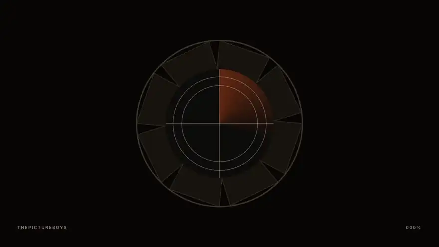
  <sub><b>Aperture iris → 3·2·1 film leader → showreel through a live film shader, with a graffiti-inspired kinetic wordmark</b></sub>
</div>

## 🎞️ The reel

<table>
  <tr>
    <td width="50%">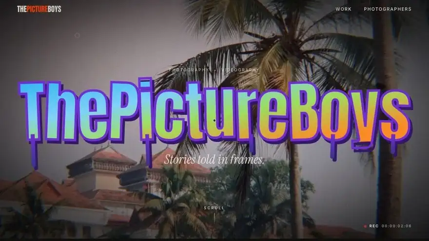<br/><sub><b>Scroll-scrubbed manifesto & rolling counters</b></sub></td>
    <td width="50%">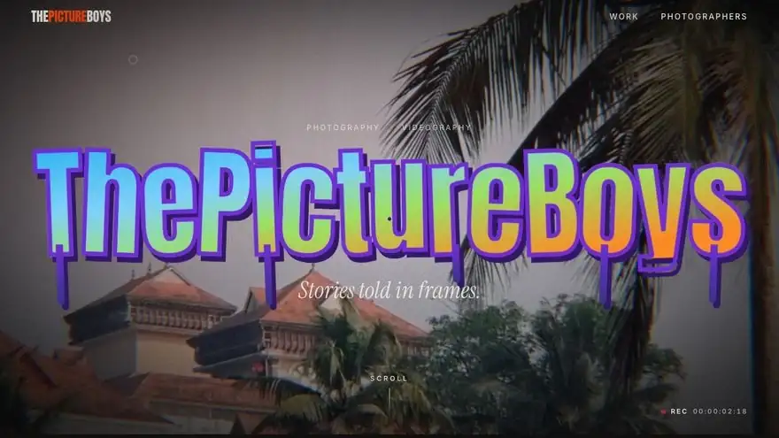<br/><sub><b>Pinned contact-sheet film strip, skewed by scroll speed</b></sub></td>
  </tr>
  <tr>
    <td width="50%">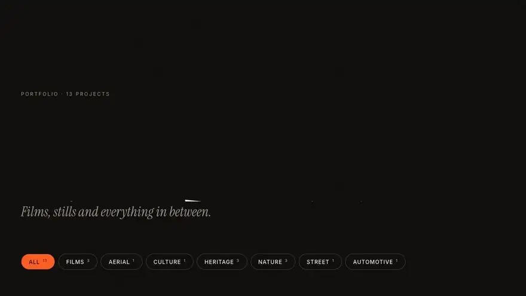<br/><sub><b>Work gallery: shared-layout filters & hover previews</b></sub></td>
    <td width="50%">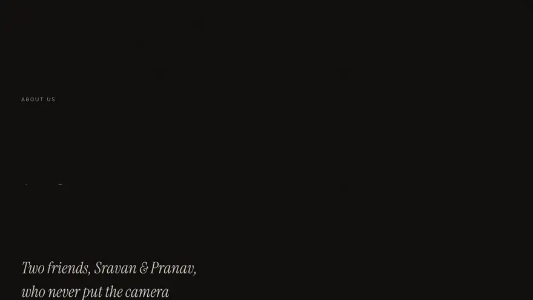<br/><sub><b>The Photographers: kinetic names & scroll timeline</b></sub></td>
  </tr>
</table>

<table>
  <tr>
    <td width="30%" align="center">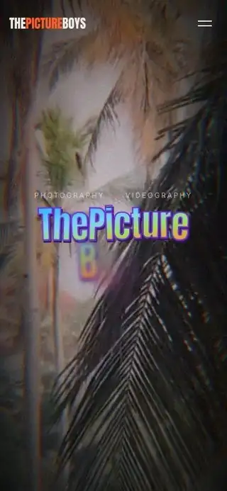<br/><sub><b>Built for phones too</b></sub></td>
    <td width="70%">

### ✨ What's inside

- **Cinematic WebGL hero.** The showreel runs through a GLSL film shader with grain, chromatic aberration, lens drift, light leaks and vignette.
- **Aperture intro.** An iris opens after a 3·2·1 film leader. It plays once per session.
- **Kinetic type.** Split-text reveals, a graffiti wordmark with paint drips, and a scroll-scrubbed manifesto.
- **Wrapped-style colour shifts.** The page tone changes as each section takes the frame.
- **Scroll choreography.** Lenis smooth scroll, a GSAP pinned film strip, stacked cards, and velocity-reactive marquees.
- **Film-cut page transitions.** A curtain wipe with a frame counter.
- **Custom cursor.** It reads PLAY or VIEW depending on what it's over, and pulls magnetic buttons toward it.
- **Liquid hover shader** on photo cards, and **hover previews** on films.
- **Theatre mode.** The page dims while a film plays.

</td>
  </tr>
</table>


## ▶️ The player

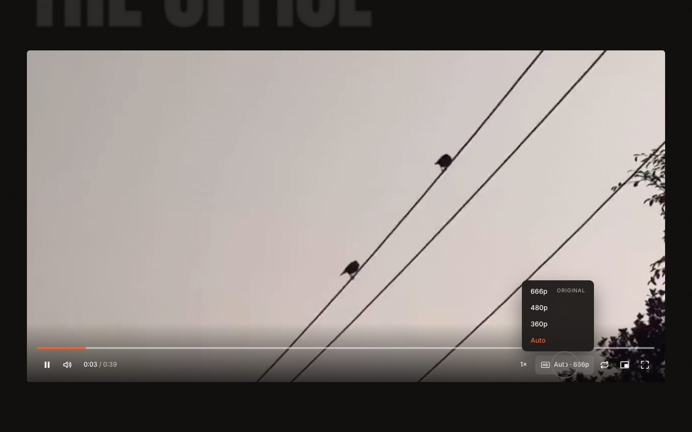

A custom React player built on HLS: hls.js everywhere, native HLS on Safari, and an MP4 fallback.

| Feature | |
|---|---|
| Quality | **Auto** or a fixed level, up to the **original resolution** (never upscaled) |
| Speed | 0.25× · 0.5× · 0.75× · 1× · 1.25× · 1.5× · 2× |
| Controls | Play/pause · seek with time preview & buffer bar · volume · loop · picture-in-picture · fullscreen |
| Touch | Double-tap left/right to skip ±10s |

<details>
<summary><b>⌨️ Keyboard shortcuts</b></summary>

| Key | Action |
|---|---|
| `Space` / `K` | Play / pause |
| `←` `→` | Seek ±5s |
| `J` `L` | Seek ±10s |
| `↑` `↓` | Volume |
| `M` | Mute |
| `F` | Fullscreen |
| `<` `>` | Slower / faster |
| `0`–`9` | Jump to 0–90% |

</details>

## 📸 Stills

<table>
  <tr>
    <td>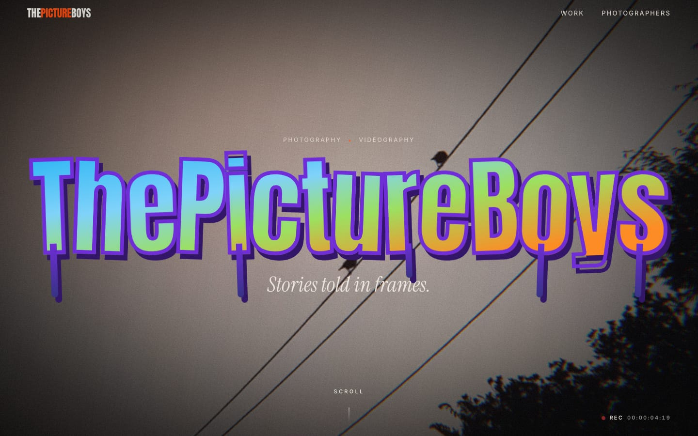</td>
    <td>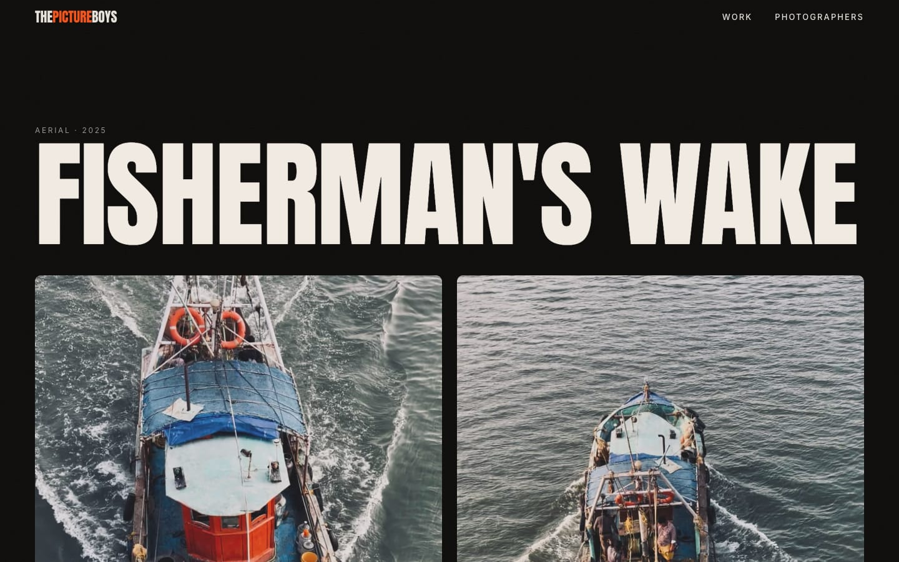</td>
  </tr>
  <tr>
    <td>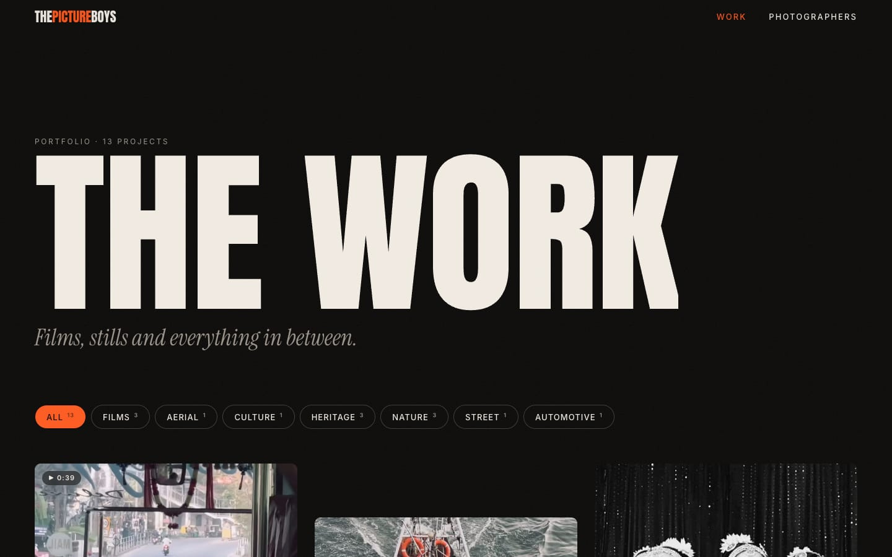</td>
    <td>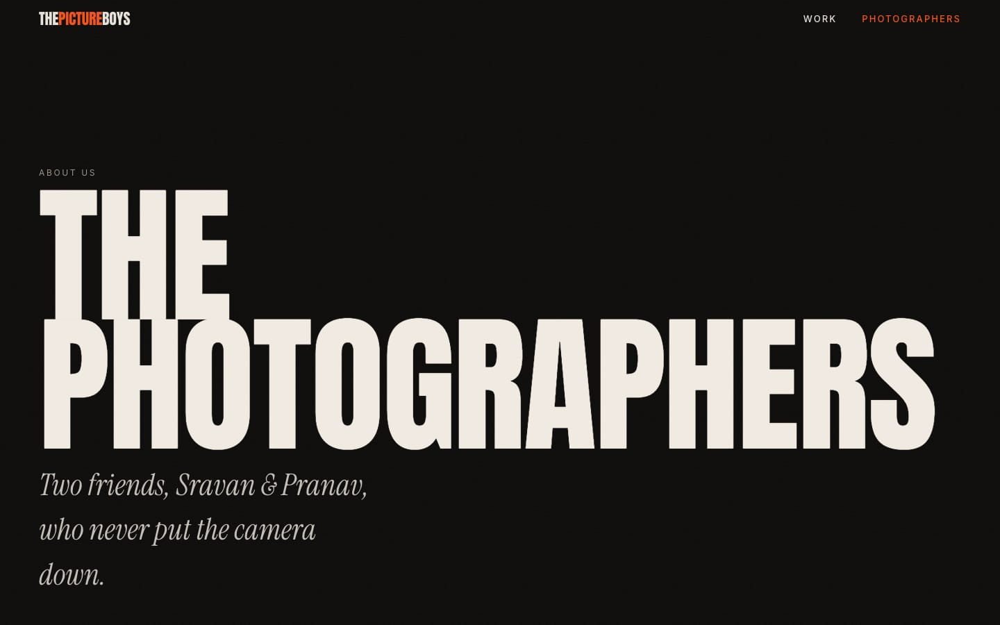</td>
  </tr>
</table>


## 🧪 Media pipeline: any format in, every browser out

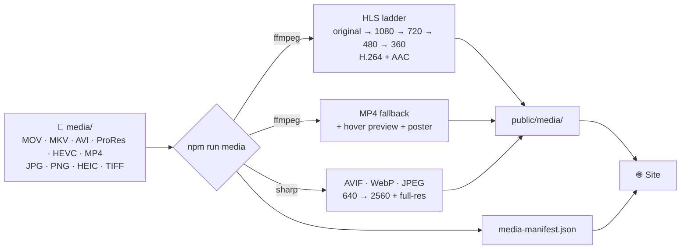

- **Never upscales.** The top quality level is always the source's native resolution.
- **Strips metadata.** GPS location, device and date information never reach the web.
- **Skips unchanged files.** Files are content-hashed, so re-runs only process what changed.
- **Always has a fallback.** Every asset ships in a universal format: JPEG for images, H.264 MP4 for video.

## 🚀 Quick start

```bash
npm install
npm run dev              # http://localhost:3000
```

| Script | What it does |
|---|---|
| `npm run dev` | Start the dev server |
| `npm run build` · `npm start` | Make and serve the production build |
| `npm run media` | Convert everything in `media/` (needs `ffmpeg`) |
| `npm run media -- --force` | Re-encode everything |
| `npm run media -- --prune` | Drop media whose source was deleted |
| `npm test` · `npm run lint` · `npm run typecheck` | Run the checks |

### Add new work

1. Drop photos or videos into `media/`. The folder is git-ignored, so only processed output is committed.
2. Run `npm run media`.
3. Add a project to [`src/content/projects.ts`](src/content/projects.ts), referring to its media by file name without the extension.

Text such as the tagline, photographers, services and stats lives in [`src/content/site.ts`](src/content/site.ts).

## 🗂️ Project structure

```text
thepictureboys/
├── .github/assets/          README visuals
├── public/media/            processed photos & HLS films (generated)
├── scripts/media/           ffmpeg + sharp pipeline (with tests)
└── src/
    ├── app/                 routes: / · /work · /work/[slug] · /about
    ├── components/
    │   ├── gl/              three.js film shader, hero film, hover distortion
    │   ├── layout/          header, menu, footer
    │   ├── motion/          intro, transitions, smooth scroll, cursor, reveals
    │   ├── player/          custom HLS video player
    │   ├── sections/        home & about sections
    │   └── work/            gallery, cards, lightbox
    ├── content/             site copy, projects, media manifest
    └── lib/                 media & player helpers (unit-tested)
```

## ☁️ Deploy

Deploys to **Vercel** with no configuration: import the repo and ship. Optional environment variables:

| Variable | Purpose |
|---|---|
| `NEXT_PUBLIC_SITE_URL` | Your domain, used for social previews |
| `NEXT_PUBLIC_MEDIA_BASE_URL` | Serve `public/media` from object storage (R2 / S3 / Blob) instead |


<div align="center">

### 📷 The Photographers

| [**Sravan Shaji**](https://instagram.com/srvnshaji) | [**Pranav Rajeev**](https://instagram.com/pranav__rajeev_) |
|:---:|:---:|
| Photographer · Filmmaker | Photographer · Filmmaker |

<sub>© ThePictureBoys. Code is shared for reference. All photographs and films are © their authors, all rights reserved, and may not be reused without permission.</sub>

</div>
